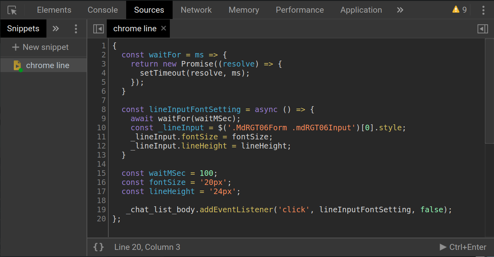

## 緣起

[chrome line-app](https://chrome.google.com/webstore/detail/line/ophjlpahpchlmihnnnihgmmeilfjmjjc) 輸入框文字大小真的很小，簡直受不了

所以用比較硬核跟粗糙的方式，修改了他的文字大小

如果有更好的方式的話，請發個 PR 給我吧，我知道這招有點硬，雖然有用

## 用法
1. 直接複製[源程式碼](chrome-line-font-size-adj.js)
2. 在 `chrome line-app` 的執行畫面下，按下 <key>F12</key>，開啟 `chrome devTools`
3. 將 `chrome devTools` 切換至 `Sources` > `Spinnets`
4. 按下 `+ New Spinnet`
5. 選擇 `Script snippet #(數字)`
6. 貼上剛剛複製的程式碼
7. `Ctrl + s` 存檔
8. `Ctrl + Enter` 執行

## 執行

每次當 chrome line-app 開啟後，都需要來此執行，也就是重複上述[用法](#usage)步驟的：

第 [2](#step-1)、[3](#step-2)、[5](#step-3)、[8](#step-4) 步驟

歸結如下:
1. 開啟 `chrome devTools`
2. 切換至 `Sources` > `Spinnets`
3. 選擇 該檔案 (`Script snippet #(數字)`)
4. `Ctrl + Enter` 執行

這樣就可以在點選聊天室清單選項時，一並放大輸入框內文大小

ps: 如果你願意的話，在 `Script snippet #(數字)` 上 `按滑鼠右鍵 > Rename ...`，可以改檔案名稱，像我就改成 `chrome line`

## 完成示意圖

